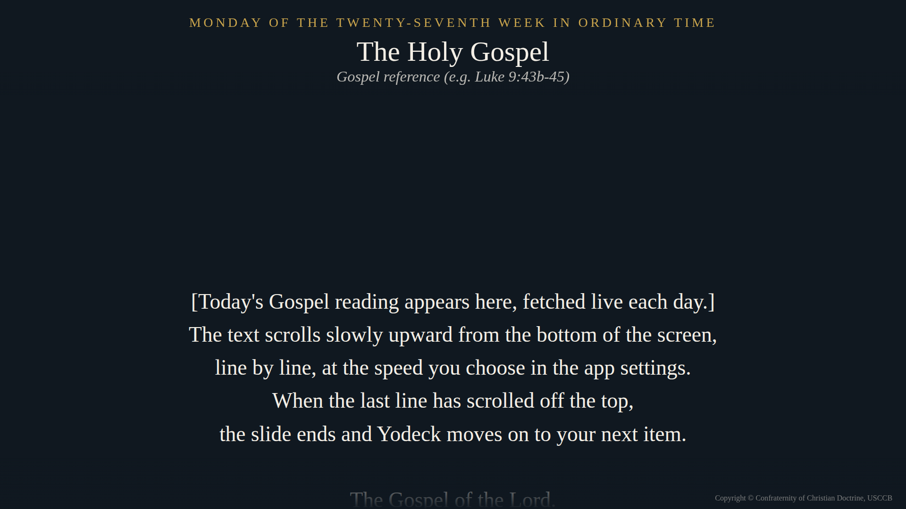

# yodeck-daily-gospel - Daily Gospel for Yodeck

A custom HTML app for [Yodeck](https://www.yodeck.com) digital signage that shows **today's Catholic Gospel reading** as slow, credits-style scrolling text, then ends itself so Yodeck moves on to the next item in your playlist.

*(Screenshot shows placeholder text. On a real screen, the day's Gospel appears.)*

**Current version: 1.05**

## Features

- Fetches the Gospel of the day automatically. Nothing to update by hand.
- Shows the liturgical day (e.g. "Monday of the Twenty-seventh week in Ordinary Time") and the Gospel reference.
- Text scrolls up from the bottom of the screen. When the last line leaves the top, the app tells Yodeck it's finished.
- Each showing has a **natural duration**: short Gospels take less time, long ones more.
- Settings in Yodeck, no code editing:
  - scroll speed and text size;
  - background, text and accent colors;
  - **Run before minute**, to show the Gospel only near the top of the hour;
  - a debug line for troubleshooting.
- If the reading can't be loaded, a small message appears for 10 seconds and the slide ends, so your playlist never gets stuck.

## Requirements

- A Yodeck account. Custom HTML apps are available on Yodeck's plans; see Yodeck for current plan details.
- A player with internet access to `feed.evangelizo.org`.

## Installation

### 1. Download the app

Download **`daily-gospel-html-app-v1.05.zip`** from the [Releases](../../releases) page. Do **not** unzip it.

### 2. Create the app in Yodeck

1. In Yodeck, go to **Apps → Discover apps**, scroll to **Custom Apps**, and click **Create HTML App**. Don't choose "Create Web App".
2. Fill in the form:
   - **Name:** `Daily Gospel` (or anything you like)
   - **Enable Chromium:** On
   - **Has natural duration:** On
   - **Select Static App:** leave as "Non static"
   - **New ZIP file:** choose the zip you downloaded
   - **UI Configuration:** replace the `{}` with the contents of [`ui-configuration.json`](ui-configuration.json)
3. Click **Save**.

### 3. Add it to a playlist

1. In **Apps → Discover apps**, search for your app, click its tile, and click **Use App**.
2. Set the options (see below) and click **Save**.
3. Add it to a playlist and push to your screens.

## Settings

| Setting | What it does | Default |
|---|---|---|
| Scroll speed | Pixels per second. Lower = slower and longer on screen. | 80 |
| Text size | Height of the text as a % of the screen height. | 4.2 |
| Run before minute | Plays only when the clock's minute is ≤ this number. Otherwise the slide skips instantly. `0` or `60` = always play. Example: `10` plays from :00 to :10 each hour. | 0 (always) |
| Background color | Screen background. The top and bottom fades follow it. | dark blue |
| Text color | Gospel text and title. | cream |
| Accent color | The liturgical-day line at the top. | gold |
| Show debug info | Shows a line with the settings the app received and the version number. | off |

### Tip: avoid the "skip flash"

With **Run before minute**, Yodeck still briefly opens the slide before the app skips it, which can cause a short flash. If your Yodeck plan includes **Scheduled Availability**, use it instead: on the app's settings, add daily time windows such as 6:00–6:10, 7:00–7:10, and so on. Then set Run before minute to `0`. Yodeck then leaves the slide out of the playlist entirely outside those times.

## Previewing in a browser

Unzip a copy and open `index.html` in Chrome. Outside Yodeck the app runs with its defaults and loops continuously instead of ending.

## How it works

- Readings come from the free **Evangelizo** daily readings feed (`feed.evangelizo.org`), the service behind [dailygospel.org](https://dailygospel.org). The app requests three items for the current date: the Gospel text, its short reference, and the liturgical title.
- The app uses Yodeck's HTML App API: `init_widget(config)` receives your settings, `start_widget()` starts each showing, and `exit_widget()` ends the slide.
- Everything is in a single `index.html` with no external libraries.

## Credits and copyright

- **Scripture texts** are from the *New American Bible, Revised Edition* (NABRE), © Confraternity of Christian Doctrine, Washington, D.C., used through the Evangelizo feed. The app displays the copyright notice on screen. This repository contains no scripture text; readings are fetched live.
- **Readings feed** courtesy of [Evangelizo](https://dailygospel.org). This project is not affiliated with or endorsed by Evangelizo, the USCCB, or Yodeck.
- **App code** © 2026 Paul Fry, released under the [MIT License](LICENSE).

## Version history

- **1.05**: First public release.
